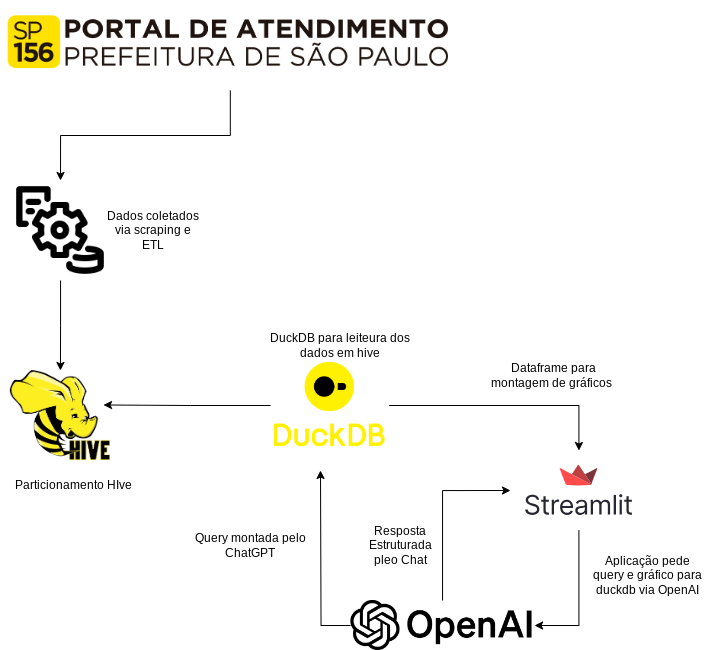

### Análise da Eficiência no Atendimento do SP156: Um Estudo sobre Disparidades De Atendimentos Regionais

Este estudo tem como objetivo explorar a base de dados dos chamados, identificando padrões de atendimento em diferentes regiões e tipos de serviço. O foco do projeto é o desenvolvimento de um chatbot que facilita a visualização dos dados, gerando gráficos e dashboards automaticamente. Essa ferramenta interativa permite que os usuários explorem métricas como a distribuição dos chamados, taxas de atendimento e tempo médio de resposta, oferecendo uma maneira prática e visual de interpretar as informações disponíveis.

### Diagrama da Solução


### Build
```
docker build --build-arg OPENAI_API_KEY=$OPENAI_API_KEY -t chat .
```

```
docker run -p 8501:8501 chat
```